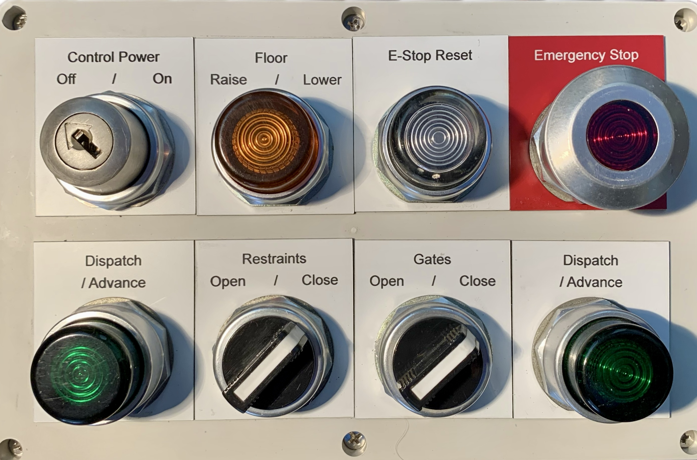

<!-- Only used for development -->
<!-- <style>
  .figure-container {
      display: flex;
      justify-content: space-between;
      overflow-x: auto;
      align-items: flex-end;  /* Aligns figures to the bottom */
      max-width: 100%;
      padding: 30px
  }

  .figure-container figure {
      display: flex;
      flex-direction: column;  /* Stack image and caption vertically */
      flex: 0 0 auto;          /* Prevent figures from stretching */
      margin: 10px;
      padding: 0;
  }

  .figure-container img {
      width: auto;
      height: 256px;
  }
  
  .figure-container figcaption {
      text-align: center;  /* Optionally center the caption */
      margin-top: 5px;     /* Add some space between image and caption */
  }
</style> -->

# Simulation of Amusement Ride Control Systems


## Introduction

Modern amusement rides are marvels of engineering, blending sophisticated systems with stringent safety requirements due to their human-rated nature. The operation of these rides involves complex procedures that must be performed accurately to ensure passenger safety and system reliability. Training ride operators and maintenance personnel is critical but often constrained by the risks [4] and costs [3] associated with using real-world equipment. This project addresses these challenges by developing a simulation-based training system designed to replicate the control and operation of amusement rides in a realistic, hands-on environment.


The project consists of two key components: a detailed 3D computer simulation and a physical control panel prototype. The simulation utilizes NoLimits 2 Roller Coaster Simulation (NL2) to provide realistic visual feedback and physics, enhanced by custom written software that adds ride control systems, safety mechanisms, and operator interfaces (Figure 1). The physical control panel (Figure 2) further complements this setup by offering a tactile training experience, incorporating industry-standard hardware to replicate real-world control systems.

<div class="figure-container">
  <figure>
    
    <figcaption><i>Figure 1. Example of a fully simulated panel within NL2</i></figcaption>
  </figure>
  <figure>
    
    <figcaption><i>Figure 2. Physical control panel prototype</i></figcaption>
  </figure>
</div>

By combining a computer-based 3D simulation with a physical control panel, this project provides a functionally accurate and interactive experience. The simulated environment allows trainees to practice standard operating procedures, troubleshoot edge cases, and respond to emergencies without the risks associated with operating actual rides. This dual-component system offers the flexibility to prototype and train on complex control systems, benefiting not only operators but also ride manufacturers exploring safer and more intuitive designs.

## Background & Inspiration

I have long been passionate about amusement parks and attractions; a unique field that combines entertainment, cutting-edge technology, and rigorous safety standards [1] to create experiences that bring joy to millions. My interest extends beyond being a casual enthusiast; I am an active member of the American Coaster Enthusiasts (ACE) non-profit organization. This involvement has allowed me to interact with industry leaders, including Neal Thurman, Park President of Six Flags Magic Mountain, as well as other operations and maintenance professionals. These conversations inspired my project and helped affirm its potential value to the industry.

The amusement industry heavily relies on mechanical and electrical engineering, but I am intrigued by how computer science can also play a role. Innovations in programmatic show control, state machines for deterministic ride operation, and simulation-based training all present opportunities for contributions from the field of computer science. Among these, I chose to focus on simulation for this project, aiming to enhance ride operator training while minimizing real-world risks.

Ride operation involves complex systems that must ensure safety, consistency, and efficiency [5]. Current training often depends on real-world equipment, which carries inherent risks and significant costs. My project addresses these challenges by creating a simulation system that provides a safe, detailed, and realistic environment for operator training. By allowing trainees to practice procedures, handle fringe cases, and respond to emergencies in a controlled setting, this solution has the potential to reduce accidents and improve safety.

Feedback from the aforementioned industry professionals supports the value of this concept, highlighting its potential to streamline training and reduce human error. This encouragement has fueled my work to develop a functional and accurate simulation that could benefit both amusement parks and ride manufacturers.

## Methodology

As mentioned previously, this project is structured around two core components: the 3D computer simulation (which includes a custom written ride control system, running on top of it) and a physical control panel to interact with said simulation. While these systems appear to work seamlessly in tandem, they are technically independent. Both components run parallel state machines, which are manually synchronized during initialization.

#### Simulation Component:

The simulation was implemented using **NoLimits 2 Roller Coaster Simulation** (NL2), which provides a realistic 3D environment and accurate physics for amusement rides. It has been utilized by amusement ride manufacturers to showcase new rides to prospective parks and guests. Such companies include Vekoma, Gerstlauer, Intamin, Zamperla, Mack, and Maurer [2]. Similar to a game engine, this was the only software tool not developed from scratch in the interest of reaching the intended goal of the project in a timely fashion. While NL2 offers ride dynamics and an embedded subset of the Java Virtual Machine (JVM) for custom software integration, it does not include advanced control systems for rides. To address this, I developed a custom control system in Java to run on NL2:

- A state machine was implemented to manage ride safety and ensure deterministic operation.
  - For example, the system enforces block zone logic [5], ensuring no two trains occupy the same segment of the ride (Figure 5).
- Sensors and operators, such as Hall-effect sensors and dispatch buttons, were modeled in 3D and programmed to respond dynamically to train and user interaction, respectively.
- The control system communicates with the simulation using NL2's API to manage ride operations, including train dispatching, gate control, and harness states (see Code section below).
- 17 custom 3D-modeled operators and sensors were created, each fully programmed and animated to represent realistic buttons, switches, indicator lamps, and sensors. SketchUp Pro 2017 was the 3D modeling tool used to create accurate models of operators (Figure 6) and sensors.

<figure>
  
  <figcaption><i>Figure 5. Simplified state machine for a single block</i></figcaption>
</figure>
<div class="figure-container">
  <figure>
    
    <figcaption><i>Figure 6. Wireframe of button 3D model</i></figcaption>
  </figure>
</div>

#### Physical Control Panel Component:

The physical control panel is a simplified, real-world mockup designed for tactile interaction during training scenarios. The panel is limited to basic station and dispatch functions but demonstrates the potential for scalability.

- Hardware:
  - Features 8 Allen-Bradley™ operators, including buttons and switches, to provide authentic hands-on experience for real operators on professional ride control panels commonly found in North America.
  - An Arduino “Leonardo” acts as the microcontroller for reading inputs and controlling indicator lamps on the physical panel (Figure 4).
- Firmware:
  - Custom C++ firmware processes inputs, controls indicator lamp states, and sends commands to the virtual simulation via simulated key presses over USB. See Figure 3 for a flow diagram of this process.
  - Since the Arduino lacks direct feedback from the simulation, it maintains its own simplified state machine to remain synchronized with the virtual system.

<div class="figure-container">
  <figure>
    
    <figcaption><i>Figure 3. Basic flow diagram of physical control panel logic</i></figcaption>
  </figure>
  <figure>
    
    <figcaption><i>Figure 4. Inside view of panel w/ Arduino controller</i></figcaption>
  </figure>
</div>

## Code

### Links:

- [NL2 Control System](https://github.com/redthirten/Reds-Panels-and-Operators/tree/main/scenery/reds_panels_and_operators/scripts)
- [Arduino Firmware for Panel](https://github.com/redthirten/NL2-Control-Panel-Leonardo)

### Examples:

#### TODO: Example 1

```java
// Example 1 java code
```

#### TODO: Example 2

```c++
// Example 2 C++ code
```

## Challenges

- Recovering from the Emergency Stop state was challenging to reproduce accurately for both the virtual and physical control panels due to how many checks are in place to leave this state and how easy it can be (by design) to unintentionally fall into this state again.
- Simulating every function an operator could perform within the system was a bit arduous.
- Iterative testing and bug fixing on the physical panel's Arduino was not ideal, as every change required a relatively slow re-compile and re-flash of its EEPROM.
- Using an Arduino as a keyboard emulator instead of a small form-factor single board computer (SBC) as a telemetry client was a compromise of cost and complexity. Details of what an SBC setup would look like is covered below, under Future Improvements.

## Conclusion

I believe this project demonstrates the feasibility of simulation-based training for amusement park ride operators and maintenance staff by successfully combining a 3D simulation with a physical control panel. The system provides a safe, cost-effective way to train operators and highlights the role of computer science in enhancing safety and efficiency in the amusement industry. The project achieved its goals through the development of a fully scripted simulation that mirrors real-world ride operations and a proof-of-concept control panel using real ride hardware for an authentic training experience. The system underwent thorough testing to validate its reliability, including block zone logic, emergency handling, and accurate state synchronization. I look forward to showcasing this prototype to members of the amusement industry, both for input on potential improvement, and for additional validation of its accuracy / usefulness in augmenting training of standard operating procedures.

## Future Improvements

NL2 offers a more advanced "telemetry server" that could potentially be used to improve this project. When the application is started with its telemetry server, clients can connect to the server to request telemetry data or remotely control the simulation. The server protocol is a binary message based protocol using TCP. Utilizing this server would likely solve the "no feedback" issue the physical panel controller currently has. Instead of using an Arduino microcontroller, a cheap SBC with GPIO pins could be used (like a Raspberry Pi) to run a custom written client, likely written in Python. This client could establish a direct connection to the telemetry server over a local network, enabling it to replicate the Arduino's functionality while also synchronizing the simulation's state (Figure 8). An additional enhancement could involve expanding the control panel to have a larger and more complex design with more operators. Finally, although time constraints prevented its implementation, adding simulated faults or safety scenarios would have provided valuable opportunities for trainee technicians or operators to practice their standard operating procedures.

<div class="figure-container">
  <figure>
    
    <figcaption><i>Figure 8. Flow diagram for physical control panel with a SBC</i></figcaption>
  </figure>
</div>

## Acknowledgements

Special Thanks:
- Dr. Michael Soltys: For his compassion, guidance, and flexibility during my capstone project.
- Ole Lange et al.: For the amazingly useful and flexible NoLimits 2 Roller Coaster Simulation software. This project would not be possible without it.
- Allen-Bradley™ by Rockwell Automation, Inc.: For the basis of the operator design and robust documentation for operator wiring and lamp specifications.
- American Coaster Enthusiasts (ACE) Organization: For giving me the opportunity to speak with real professionals in the amusement industry.
- The NoLimits Central Community: For programming, 3D modeling, and testing support.

## References

1. ASTM International. _Standard Practice for Design of Amusement Rides and Devices_. F2291-2006, State of Indiana, 685 IAC 1-2-9, ASTM International, 2006. ASTM, doi:10.1520/F2291-17. Accessed at www.astm.org.
2. Lange, Ole. “_Info - NoLimits 1_.” NoLimits 2 - Roller Coaster Simulation, nolimitscoaster.com/index.php/info.
3. Locknear, Francis. “_How Much Does It Cost to Build a Roller Coaster? (2023)_.” TheCostGuys, 30 Mar. 2023, thecostguys.com/business/build-roller-coaster.
4. Mease, Cameron. “_Amusement Ride Safety Is a Partnership_.” BRPH, 20 Jan. 2023, www.brph.com/amusement-ride-safety-is-a-partnership/.
5. Väisänen, Antti. “_Design of Roller Coasters_.” Aalto University, 24 July 2018, https://web.archive.org/web/20201112015716/https://aaltodoc.aalto.fi/bitstream/handle/123456789/33706 /master_V%C3%A4is%C3%A4nen_Antti_2018.pdf. Accessed 6 Nov. 2024.
